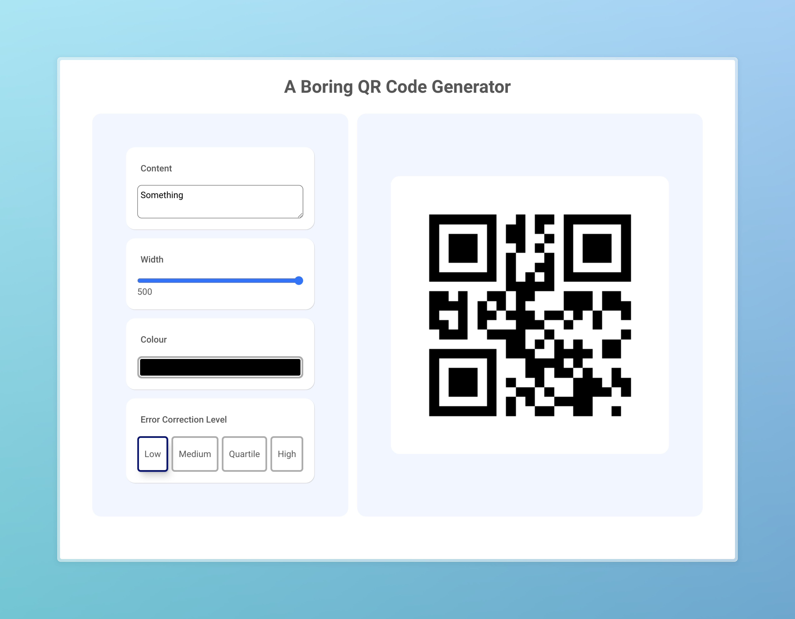

# A Boring QR Code Generator App

A QR code generator made with React. Mostly from scratch. Minimal dependencies. That's it.

[Try it](https://p-lu.github.io/qr-code-app/)

## Bugs and improvements

- Colour picker is wobbly and unstable in the dark colours
- Keyboard support
- Throttling/ debouncing
